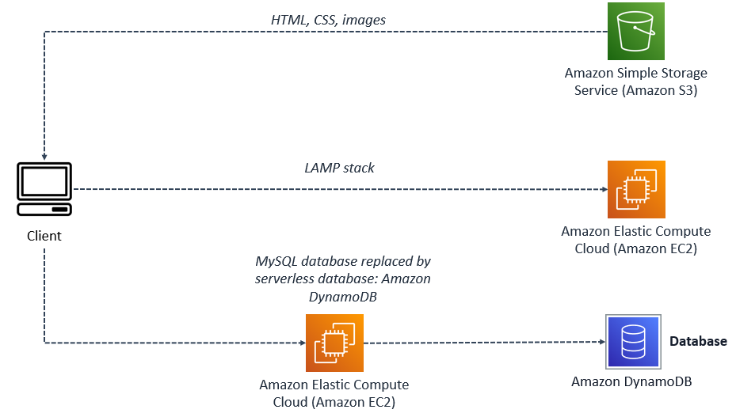

# Evolution of a website: Going from single server to serverless  

## background
You start by creating the company’s static website hosted on Amazon Simple Storage Service (S3) that displays the ice cream flavors. The business starts to gain popularity among the locals and flavors start to sell out before the day is up. The business owners ask you to migrate to a server where they can have you push updates. They decide to migrate their static site to Amazon Elastic Compute Cloud (EC2) with a Linux, Apache, MySQL, PHP (LAMP) stack built on it.
您首先创建托管在亚马逊简单存储服务 （S3） 上的公司的静态网站，该网站显示冰淇淋口味。该业务开始在当地人中流行起来，口味在一天结束之前就开始售罄。企业主要求您迁移到他们可以让你推送更新的服务器。他们决定将静态站点迁移到 Amazon Elastic Compute Cloud （EC2），并在其上构建 Linux、Apache、MySQL、PHP （LAMP） 堆栈。

This will allow the website to update and react dynamically. Demand for AnyCompany’s ice cream surges after a viral video and the infrastructure and maintenance becomes difficult to manage. To scale with demand, you suggest migrating sections of their LAMP stack to serverless services, starting with the MySQL database. The MySQL database will be replaced with Amazon DynamoDB serverless database.
这将允许网站动态更新和反应。在病毒视频发布后，对 AnyCompany 冰淇淋的需求激增，基础设施和维护变得难以管理。为了根据需求进行扩展，您建议将其 LAMP 堆栈的各个部分迁移到无服务器服务，从 MySQL 数据库开始。MySQL 数据库将替换为 Amazon DynamoDB 无服务器数据库。
## APPLICATION ARCHITECTURE  
The application architecture uses the following services:  
应用程序体系结构使用以下服务：

- Static site: Amazon S3 which contains HTML, CSS, and images.  
    静态站点：包含 HTML、CSS 和图像的 Amazon S3。
- Dynamic site: Amazon EC2 Linux, Apache web server, MySQL database, and PHP (LAMP) stack will come pre installed. This will allow the owner or developer to update the flavors available for the day.  
    动态站点：Amazon EC2 Linux、Apache Web 服务器、MySQL 数据库和 PHP （LAMP） 堆栈将预装。这将允许所有者或开发人员更新当天可用的口味。
- Serverless: Amazon DynamoDB. This will replace the MySQL database and make the database portion serverless.  
    无服务器：Amazon DynamoDB。这将替换 MySQL 数据库并使数据库部分无服务器。

Figure: The preceding architecture shows three different ways the client is accessing information. The client can access static content through Amazon S3 which holds the HTML, CSS, and image files. Dynamic content can be accessed through the dynamic site hosted on Amazon EC2. The site has a database, and is able to update content through its server. The last way to access this site is keeping the Amazon EC2 instance, and migrating the database to a serverless database, which is seen in this diagram.  
图：前面的体系结构显示了客户端访问信息的三种不同方式。客户端可以通过保存 HTML、CSS 和图像文件的 Amazon S3 访问静态内容。可以通过 Amazon EC2 上托管的动态站点访问动态内容。该网站有一个数据库，并且能够通过其服务器更新内容。访问此站点的最后一种方法是保留 Amazon EC2 实例，并将数据库迁移到无服务器数据库，如下图所示。

## step
- Update the database with a new flavor using the Amazon DynamoDB console.  使用 Amazon DynamoDB 控制台使用新风格更新数据库。
- Update the **index.php** file to point to the Amazon DynamoDB database using a bash script.  使用 bash 脚本更新索引.php文件以指向 Amazon DynamoDB 数据库。
- Refresh the website to see that it is now pulling in content from the Amazon DynamoDB database revealing the the new flavor you just added.  刷新网站，看看它现在正在从 Amazon DynamoDB 数据库中提取内容，显示您刚刚添加的新风格。

# Serverless Architectures with Amazon DynamoDB and Amazon Kinesis Streams with AWS Lambda
## Lab Overview 实验室概述

This is a two-part lab. In part one of the lab, you create a Lambda function from a blueprint, create an Amazon Kinesis Stream, then trigger the function with data from your stream and monitor the process with Amazon CloudWatch.  
这是一个由两部分组成的实验室。在本练习的第一部分中，您将从蓝图创建 Lambda 函数，创建 Amazon Kinesis Stream，然后使用流中的数据触发该函数，并使用 Amazon CloudWatch 监控流程。

In part two of the lab, you learn the basics of event-driven programming using Amazon DynamoDB, DynamoDB Streams, and AWS Lambda. You learn the process of building a real-world application using triggers that combine DynamoDB Streams and Lambda.  
在本练习的第二部分中，您将学习使用 Amazon DynamoDB、DynamoDB Streams 和 AWS Lambda 进行事件驱动编程的基础知识。您将了解使用组合 DynamoDB 流和 Lambda 的触发器构建实际应用程序的过程。

### OBJECTIVES 目标

By the end of this lab, you will be able to do the following:  
在本实验结束时，您将能够执行以下操作：

- Create an AWS Lambda function from a blueprint  
    从蓝图创建 AWS Lambda 函数
- Create an Amazon Kinesis Stream  
    创建 Amazon Kinesis 流
- Use Amazon CloudWatch to monitor Kinesis event data triggering your Lambda function  
    使用 Amazon CloudWatch 监控触发 Lambda 函数的 Kinesis 事件数据
- Create an Amazon DynamoDB table and insert items  
    创建 Amazon DynamoDB 表并插入项目
- Enable the Amazon DynamoDB Streams feature  
    启用 Amazon DynamoDB 流功能
- Configure and troubleshoot Lambda functions  
    配置和排除 Lambda 函数故障

# build a serverless, full-stack single-page app with authentication
You learn about the React library’s features for building user interfaces. Then you use AWS Amplify to add AWS services and integrate them with your frontend. This includes adding authentication via Amazon Cognito and creating a secure REST API powered by Amazon API Gateway. You further extend the backend with a serverless function via AWS Lambda that interacts with the Amazon EC2 service.  
您将了解 React 库用于构建用户界面的功能。然后，您可以使用 AWS Amplify 添加 AWS 服务并将其与您的前端集成。这包括通过 Amazon Cognito 添加身份验证，以及创建由 Amazon API Gateway 提供支持的安全 REST API。您可以通过与 Amazon EC2 服务交互的 AWS Lambda 使用无服务器函数进一步扩展后端。

Finally, you use AWS Amplify to add hosting your app, allowing it to be delivered to end-users on the AWS content delivery network using Amazon CloudFront. All application development happens within the AWS Cloud9 IDE.  
最后，您可以使用 AWS Amplify 添加托管应用程序，从而允许使用 Amazon CloudFront 将其交付给 AWS 内容交付网络上的最终用户。所有应用程序开发都在 AWS Cloud9 IDE 中进行。
