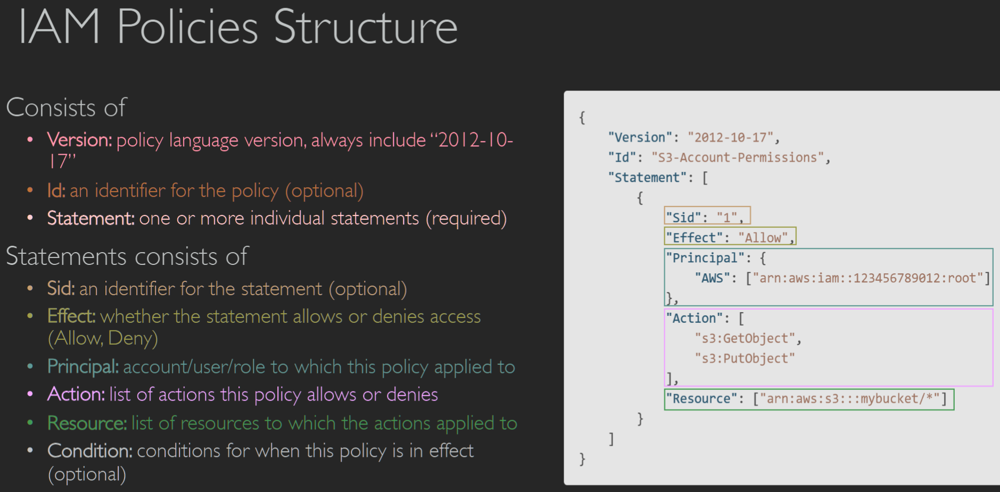

# Reference
[Ultimate AWS Certified Solutions Architect Associate (SAA) | Udemy](https://www.udemy.com/course/aws-certified-solutions-architect-associate-saa-c03/)  
[AWS Certified Solutions Architect – Associate Certification](https://aws.amazon.com/certification/certified-solutions-architect-associate/)  
[AWS-Certified-Solutions-Architect-Associate\_Exam-Guide.pdf](https://d1.awsstatic.com/training-and-certification/docs-sa-assoc/AWS-Certified-Solutions-Architect-Associate_Exam-Guide.pdf)  
[AWS-Certified-Solutions-Architect-Associate\_Sample-Questions.pdf](https://d1.awsstatic.com/training-and-certification/docs-sa-assoc/AWS-Certified-Solutions-Architect-Associate_Sample-Questions.pdf)  
[GitHub - GreenH47/AWS\_certified: AWS certified exam preparation](https://github.com/GreenH47/AWS_certified)  

# Exam Guide 
[AWS-Certified-Solutions-Architect-Associate\_Exam-Guide.pdf](https://d1.awsstatic.com/training-and-certification/docs-sa-assoc/AWS-Certified-Solutions-Architect-Associate_Exam-Guide.pdf)  
There are two types of questions on the exam:  
• Multiple choice: Has one correct response and three incorrect responses (distractors)  
• Multiple response: Has two or more correct responses out of five or more response options  

## Domain of Exam  
1. Domain 1: Design Secure Architectures 30%   Design secure access to AWS resources Design secure workloads and applications Determine appropriate data security controls 设计对 AWS 资源的安全访问 ๏ 设计安全的工作负载和应用程序 ๏ 确定适当的数据安全控制 (AWS Identity and Access Management [IAM], AWS Regions, Control ports, protocols, and network traffic, Amazon Cognito, VPC architecture, subnetwork segmentation, Data access and governance)  
2. Domain 2: Design Resilient Architectures 26%  Design scalable and loosely coupled architecture Design highly available and/or fault-tolerant architectures 设计可扩展且松散耦合的架构 ๏ 设计高可用性和/或容错架构 (API creation and management, )  
3. Domain 3: Design High-Performing Architectures 24%   Determine high-performing and/or scalable storage solutions Design high-performing and elastic compute solutions Determine high-performing database solutions Determine high-performing and/or scalable network architectures Determine high-performing data ingestion and transformation solutions 确定高性能和/或可扩展存储解决方案 ๏ 设计高性能和弹性计算解决方案 ๏ 确定高性能数据库解决方案 ๏ 确定高性能和/或可扩展网络架构 ๏ 确定高性能数据摄取和转换解决方案  
4. Domain 4: Design Cost-Optimized Architectures 20%  Design cost-optimized storage solutions Design cost-optimized compute solutions Design cost-optimized database solutions Design cost-optimized network architectures 设计成本优化的存储解决方案 ๏ 设计成本优化的计算解决方案 ๏ 设计成本优化的数据库解决方案 ๏ 设计成本优化的网络架构

# IAM
IAM = Identity and Access Management, Global service IAM = 身份和访问管理、全球服务  
Users or Groups can be assigned JSON documents called policies In AWS you apply the least  privilege principle: don’t give more permissions than a user needs 在 AWS 中，您应用最小权限原则：不要授予超出用户需要的权限  
## IAM Policies Structure
  
• Users: mapped to a physical user, has a password for AWS Console  
• Groups: contains users only  
• Policies: JSON document that outlines permissions for users or groups  
• Roles: for EC2 instances or AWS services  
• Security: MFA + Password Policy  
• AWS CLI: manage your AWS services using the command-line  
• AWS SDK: manage your AWS services using a programming language  
• Access Keys: access AWS using the CLI or SDK  
• Audit: IAM Credential Reports & IAM Access Advisor  

# EC2 Elastic Compute Cloud
EC2 = Elastic Compute Cloud = Infrastructure as a Service It mainly consists in the capability of :  EC2 = 弹性计算云 = 基础设施即服务 • 它主要包括以下功能：
• Renting virtual machines租用虚拟机 (EC2)  
• Storing data on virtual drives在虚拟驱动器上存储数据 (EBS)  
• Distributing load across machines跨机器分配负载 (ELB)  
• Scaling the services using an auto-scaling group使用自动缩放组缩放服务 (ASG)  

[Compute – Amazon EC2 Instance Types – AWS](https://aws.amazon.com/ec2/instance-types/)  

## Security Groups
Inbound and Outbound Rules: Security groups enable you to define rules to control inbound traffic (incoming connections) and outbound traffic (outgoing connections) for your EC2 instances. Each rule specifies a protocol, port range, and source or destination IP addresses. 入站和出站规则：安全组使您能够定义规则来控制 EC2 实例的入站流量（传入连接）和出站流量（传出连接）。每个规则指定协议、端口范围以及源或目标 IP 地址。 
22 = SSH (Secure Shell) - log into a Linux instance
• 21 = FTP (File Transfer Protocol) – upload files into a file share
• 22 = SFTP (Secure File Transfer Protocol) – upload files using SSH
• 80 = HTTP – access unsecured websites
• 443 = HTTPS – access secured websites
• 3389 = RDP (Remote Desktop Protocol) – log into a Windows instance  
The rules are evaluated in a sequential manner. If a rule matches the incoming network traffic, then the action specified in that rule (e.g., allow or deny) will be applied. If no rule matches, the traffic will be denied by default.  规则按顺序进行评估。如果规则与传入的网络流量匹配，则将应用该规则中指定的操作（例如，允许或拒绝）。如果没有匹配的规则，则默认情况下将拒绝流量。 

## Placement Groups
In AWS, a Placement Group is a logical grouping of EC2 instances within a single Availability Zone. It allows you to influence the placement of instances to provide better performance or isolation.  在 AWS 中，置放群组是单个可用区内 EC2 实例的逻辑分组。它允许您影响实例的位置，以提供更好的性能或隔离  
There are three types of Placement Groups:  
归置组有三种类型：

1. Cluster Placement Group: This type is designed for applications that require low network latency and high network throughput. Instances in a cluster placement group are placed close to each other within a single rack, which enables high-bandwidth, low-latency communication between them. This type is suitable for applications like HPC (High-Performance Computing) workloads or big data analytics.  
    集群置放群组：此类型专为需要低网络延迟和高网络吞吐量的应用程序而设计。集群置放群组中的实例彼此靠近放置在单个机架内，从而实现它们之间的高带宽、低延迟通信。此类型适用于 HPC（高性能计算）工作负载或大数据分析等应用程序。
    
2. Spread Placement Group: This type is used to spread instances across distinct underlying hardware to minimize the impact of hardware failures on the availability of your application. Instances in a spread placement group are placed on different racks, ensuring that they are physically isolated for greater fault tolerance. This type is suitable for critical applications that require high availability.  
    分散置放群组：此类型用于将实例分散到不同的底层硬件上，以最大程度地减少硬件故障对应用程序可用性的影响。分散置放组中的实例放置在不同的机架上，确保它们在物理上隔离，以提高容错能力。此类型适用于需要高可用性的关键应用程序。
    
3. Partition Placement Group: This type enables you to spread your instances across logical partitions (up to seven) within a single Availability Zone. Each partition behaves as an independent rack with its own network and power source. This type is useful when you need to maximize fault tolerance by isolating instances from each other at the hardware level.  
    分区置放群组：此类型使您能够将实例分布在单个可用区内的逻辑分区（最多 7 个）。每个分区都表现为一个独立的机架，具有自己的网络和电源。当您需要通过在硬件级别将实例彼此隔离来最大化容错能力时，此类型非常有用。

## Elastic Network Interface (ENI)
[New – Elastic Network Interfaces in the Virtual Private Cloud | AWS News Blog](https://aws.amazon.com/blogs/aws/new-elastic-network-interfaces-in-the-virtual-private-cloud/)  
In AWS, an Elastic Network Interface (ENI) is a virtual network interface that you can attach to an EC2 instance. It provides networking capabilities to the instance, allowing it to communicate with other resources within your VPC (Virtual Private Cloud) or across the internet.  
在 AWS 中，弹性网络接口 （ENI） 是可以附加到 EC2 实例的虚拟网络接口。它为实例提供联网功能，使其能够与 VPC（虚拟私有云）内的其他资源或通过互联网进行通信  
Elastic Network Interfaces provide flexibility, high availability, advanced networking capabilities, and security features to your EC2 instances. They allow you to customize and optimize networking setups for your specific application requirements, providing greater control and performance.  
总体而言，弹性网络接口为您的 EC2 实例提供了灵活性、高可用性、高级联网功能和安全功能。它们允许您根据特定应用要求自定义和优化网络设置，从而提供更好的控制和性能。 

1. Multiple ENIs per Instance: You can attach multiple ENIs to an EC2 instance. Each ENI can have its own private IP address, security group rules, and elastic IP addresses. This allows you to configure different network interfaces for specific use cases or network configurations.  
    每个实例多个 ENI：您可以将多个 ENI 附加到一个 EC2 实例。每个弹性网卡都可以有自己的内网IP地址、安全组规则和弹性公网IP。这允许您为特定用例或网络配置配置不同的网络接口。
    
2. High Availability and Failover: ENIs can be associated with multiple subnets within a VPC and can be easily moved between instances using an Elastic IP address (EIP). This provides high availability and failover capabilities for your applications in case of instance failure.  
    高可用性和故障转移：弹性网卡可以与 VPC 内的多个子网关联，并且可以使用弹性 IP 地址 （EIP） 在实例之间轻松移动。这为您的应用程序提供了高可用性和故障转移功能，以防实例发生故障

## EBS Elastic Block Store(like usb disk)
In AWS, EBS stands for Elastic Block Store, and it is a scalable block storage service designed for use with EC2 instances. EBS provides persistent storage that can be attached to EC2 instances as virtual disks, similar to a hard drive.  
在 AWS 中，EBS 代表弹性块存储，它是一种可扩展的块存储服务，旨在与 EC2 实例一起使用。EBS 提供持久存储，可作为虚拟磁盘附加到 EC2 实例，类似于硬盘驱动器。  

## EBS Snapshots
In AWS, EBS snapshots are a mechanism for backing up and recovering data from EBS volumes. An EBS snapshot is a point-in-time copy of an EBS volume, capturing its contents including data, configurations, and metadata 在 AWS 中，EBS 快照是一种从 EBS 卷备份和恢复数据的机制。EBS 快照是 EBS 卷的时间点副本，可捕获其内容，包括数据、配置和元数据。  
EBS snapshots provide a cost-effective and efficient method to back up your data stored on EBS volumes in AWS. They offer data recovery options, replication for disaster recovery, and encryption for securing sensitive information. By leveraging EBS snapshots, you can achieve better data protection and enhance the resilience of your applications and services.  
EBS 快照提供了一种经济高效的方式来备份存储在 AWS 中的 EBS 卷上的数据。它们提供数据恢复选项、用于灾难恢复的复制以及用于保护敏感信息的加密。通过利用 EBS 快照，您可以实现更好的数据保护并增强应用程序和服务的弹性。  

## AMI = Amazon Machine Image  
AMI are a customization of an EC2 instance  
• You add your own software, configuration, operating system, monitoring...  
• Faster boot / configuration time because all your software is pre-packaged  
AMI 是 EC2 实例的定制 • 您添加自己的软件、配置、操作系统、监控... • 由于所有软件均已预先打包，因此启动/配置时间更快

## Multi-Attach
Attach the same EBS volume to multiple EC2  instances in the same AZ  Each instance has full read & write permissions to the high-performance volume 将相同的 EBS 卷附加到同一可用区中的多个 EC2 实例 • 每个实例都对高性能卷具有完整的读写权限 Up to 16 EC2 Instances at a time 一次最多 16 个 EC2 实例  

## EFS – Elastic File System  
AWS EFS (Amazon Elastic File System) is a fully managed, scalable, and highly available file storage service provided by Amazon Web Services (AWS). It is designed to provide shared file storage for EC2 instances and other AWS services.  AWS EFS（Amazon Elastic File System）是由 Amazon Web Services （AWS） 提供的完全托管、可扩展且高度可用的文件存储服务。它旨在为 EC2 实例和其他 AWS 服务提供共享文件存储。 
The main function of AWS EFS is to provide a fully managed and scalable file system that can be accessed from multiple EC2 instances concurrently. It allows multiple instances to read and write data to the file system concurrently, making it suitable for use cases that require shared access to data.  AWS EFS 的主要功能是提供可从多个 EC2 实例同时访问的完全托管且可扩展的文件系统。它允许多个实例同时向文件系统读取和写入数据，使其适用于需要共享数据访问的使用案例。

## comparison between EBS and EFS  

|Feature 特征|EBS (Elastic Block Store)   EBS（弹性块存储）|EFS (Elastic File System)   EFS（弹性文件系统）|
|---|---|---|
|Storage Type 存储类型|Block-level storage 块级存储|File-level storage 文件级存储|
|Access Method|Mounted as block devices to EC2 instances   作为块储存设备挂载到 EC2 实例|Accessed via NFS protocol   通过 NFS 协议访问|
|Shared Access 共享访问|Not designed for shared access   不是为共享访问而设计的|Multiple instances can access concurrently   多个实例可以同时访问|
|Use Cases 使用案例|Boot volumes, database storage, etc.   引导卷、数据库存储等|Shared web hosting, content management systems, etc.   共享虚拟主机、内容管理系统等。|
|Scalability 可扩展性|Resizable but may require downtime   可调整大小，但可能需要停机|Automatically scales without downtime   自动扩展，无需停机|
|Availability 可用性|Redundancy within single availability zone   单个可用区内的冗余|Replication across multiple availability zones   跨多个可用区进行复制|
|Durability 耐久性|Snapshots and replication for backups   用于备份的快照和复制|Replication for high durability   复制以实现高持久性|
