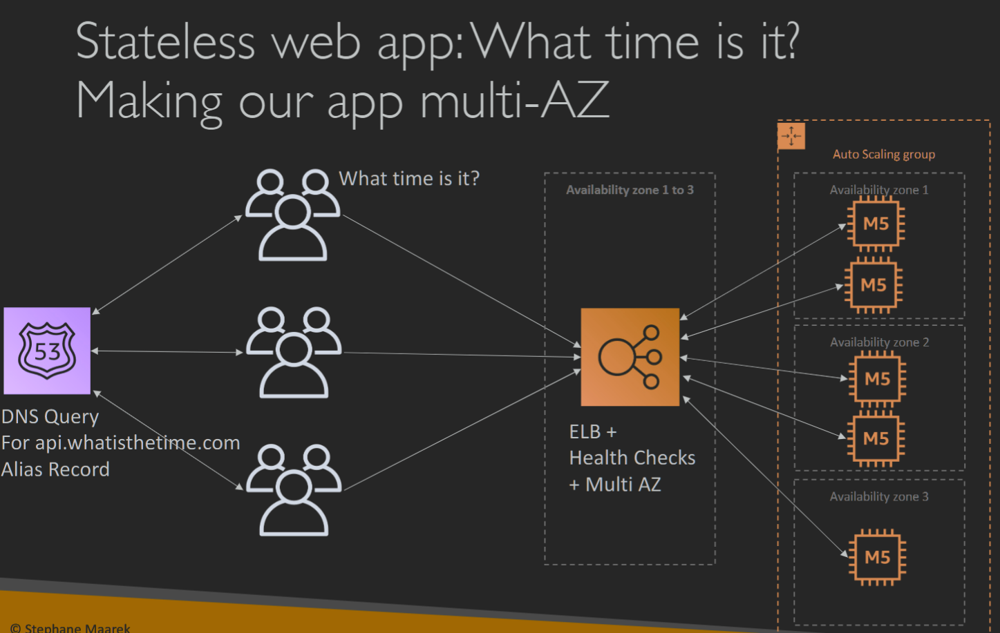
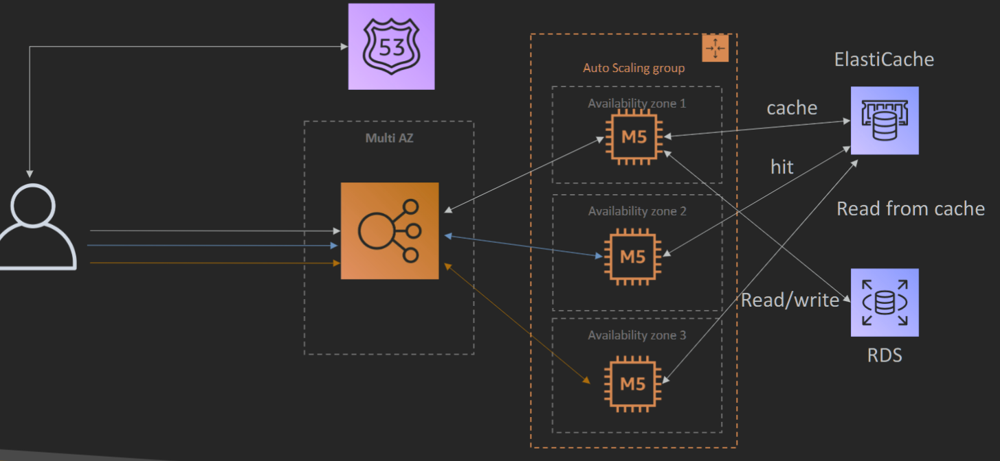
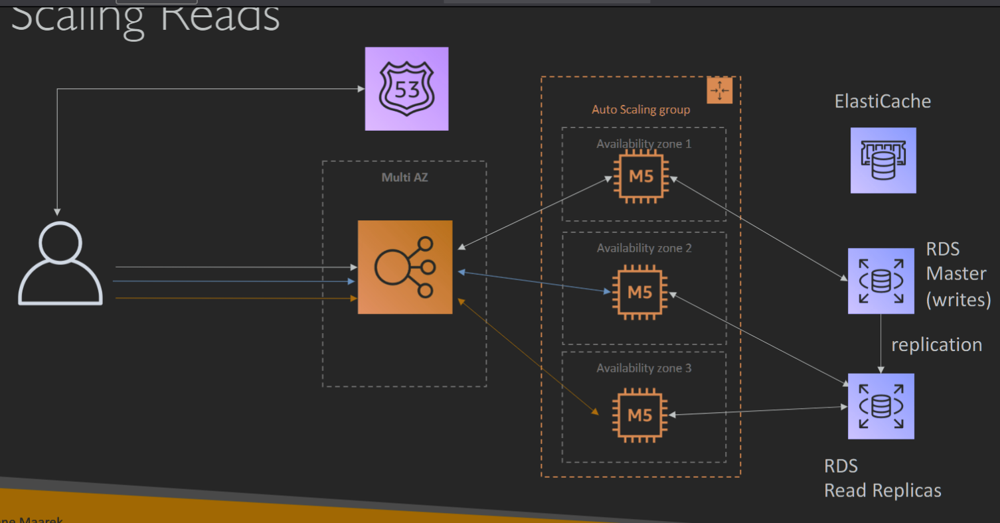
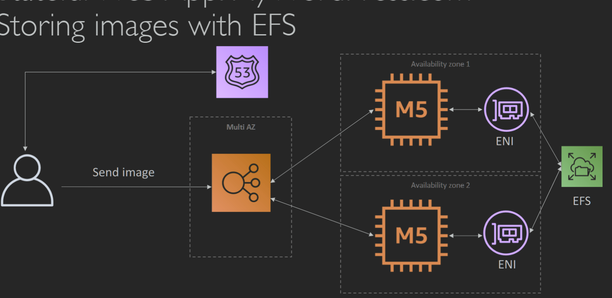

# Reference
[Ultimate AWS Certified Solutions Architect Associate (SAA) | Udemy](https://www.udemy.com/course/aws-certified-solutions-architect-associate-saa-c03/)  
[AWS Certified Solutions Architect – Associate Certification](https://aws.amazon.com/certification/certified-solutions-architect-associate/)  
[AWS-Certified-Solutions-Architect-Associate\_Exam-Guide.pdf](https://d1.awsstatic.com/training-and-certification/docs-sa-assoc/AWS-Certified-Solutions-Architect-Associate_Exam-Guide.pdf)  
[AWS-Certified-Solutions-Architect-Associate\_Sample-Questions.pdf](https://d1.awsstatic.com/training-and-certification/docs-sa-assoc/AWS-Certified-Solutions-Architect-Associate_Sample-Questions.pdf)  
[GitHub - GreenH47/AWS\_certified: AWS certified exam preparation](https://github.com/GreenH47/AWS_certified)  

# Exam Guide 
[AWS-Certified-Solutions-Architect-Associate\_Exam-Guide.pdf](https://d1.awsstatic.com/training-and-certification/docs-sa-assoc/AWS-Certified-Solutions-Architect-Associate_Exam-Guide.pdf)  
There are two types of questions on the exam:  
• Multiple choice: Has one correct response and three incorrect responses (distractors)  
• Multiple response: Has two or more correct responses out of five or more response options  

## Domain of Exam  
1. Domain 1: Design Secure Architectures 30%   Design secure access to AWS resources Design secure workloads and applications Determine appropriate data security controls 设计对 AWS 资源的安全访问 ๏ 设计安全的工作负载和应用程序 ๏ 确定适当的数据安全控制 (AWS Identity and Access Management [IAM], AWS Regions, Control ports, protocols, and network traffic, Amazon Cognito, VPC architecture, subnetwork segmentation, Data access and governance)  
2. Domain 2: Design Resilient Architectures 26%  Design scalable and loosely coupled architecture Design highly available and/or fault-tolerant architectures 设计可扩展且松散耦合的架构 ๏ 设计高可用性和/或容错架构 (API creation and management, )  
3. Domain 3: Design High-Performing Architectures 24%   Determine high-performing and/or scalable storage solutions Design high-performing and elastic compute solutions Determine high-performing database solutions Determine high-performing and/or scalable network architectures Determine high-performing data ingestion and transformation solutions 确定高性能和/或可扩展存储解决方案 ๏ 设计高性能和弹性计算解决方案 ๏ 确定高性能数据库解决方案 ๏ 确定高性能和/或可扩展网络架构 ๏ 确定高性能数据摄取和转换解决方案  
4. Domain 4: Design Cost-Optimized Architectures 20%  Design cost-optimized storage solutions Design cost-optimized compute solutions Design cost-optimized database solutions Design cost-optimized network architectures 设计成本优化的存储解决方案 ๏ 设计成本优化的计算解决方案 ๏ 设计成本优化的数据库解决方案 ๏ 设计成本优化的网络架构

# IAM
IAM = Identity and Access Management, Global service IAM = 身份和访问管理、全球服务  
Users or Groups can be assigned JSON documents called policies In AWS you apply the least  privilege principle: don’t give more permissions than a user needs 在 AWS 中，您应用最小权限原则：不要授予超出用户需要的权限  
## IAM Policies Structure
  
• Users: mapped to a physical user, has a password for AWS Console  
• Groups: contains users only  
• Policies: JSON document that outlines permissions for users or groups  
• Roles: for EC2 instances or AWS services  
• Security: MFA + Password Policy  
• AWS CLI: manage your AWS services using the command-line  
• AWS SDK: manage your AWS services using a programming language  
• Access Keys: access AWS using the CLI or SDK  
• Audit: IAM Credential Reports & IAM Access Advisor  

# EC2 Elastic Compute Cloud
EC2 = Elastic Compute Cloud = Infrastructure as a Service It mainly consists in the capability of :  EC2 = 弹性计算云 = 基础设施即服务 • 它主要包括以下功能：
• Renting virtual machines租用虚拟机 (EC2)  
• Storing data on virtual drives在虚拟驱动器上存储数据 (EBS)  
• Distributing load across machines跨机器分配负载 (ELB)  
• Scaling the services using an auto-scaling group使用自动缩放组缩放服务 (ASG)  

[Compute – Amazon EC2 Instance Types – AWS](https://aws.amazon.com/ec2/instance-types/)  

## Security Groups
Inbound and Outbound Rules: Security groups enable you to define rules to control inbound traffic (incoming connections) and outbound traffic (outgoing connections) for your EC2 instances. Each rule specifies a protocol, port range, and source or destination IP addresses. 入站和出站规则：安全组使您能够定义规则来控制 EC2 实例的入站流量（传入连接）和出站流量（传出连接）。每个规则指定协议、端口范围以及源或目标 IP 地址。 
22 = SSH (Secure Shell) - log into a Linux instance
• 21 = FTP (File Transfer Protocol) – upload files into a file share
• 22 = SFTP (Secure File Transfer Protocol) – upload files using SSH
• 80 = HTTP – access unsecured websites
• 443 = HTTPS – access secured websites
• 3389 = RDP (Remote Desktop Protocol) – log into a Windows instance  
The rules are evaluated in a sequential manner. If a rule matches the incoming network traffic, then the action specified in that rule (e.g., allow or deny) will be applied. If no rule matches, the traffic will be denied by default.  规则按顺序进行评估。如果规则与传入的网络流量匹配，则将应用该规则中指定的操作（例如，允许或拒绝）。如果没有匹配的规则，则默认情况下将拒绝流量。 

## Placement Groups
In AWS, a Placement Group is a logical grouping of EC2 instances within a single Availability Zone. It allows you to influence the placement of instances to provide better performance or isolation.  在 AWS 中，置放群组是单个可用区内 EC2 实例的逻辑分组。它允许您影响实例的位置，以提供更好的性能或隔离  
There are three types of Placement Groups:  
归置组有三种类型：

1. Cluster Placement Group: This type is designed for applications that require low network latency and high network throughput. Instances in a cluster placement group are placed close to each other within a single rack, which enables high-bandwidth, low-latency communication between them. This type is suitable for applications like HPC (High-Performance Computing) workloads or big data analytics.  
    集群置放群组：此类型专为需要低网络延迟和高网络吞吐量的应用程序而设计。集群置放群组中的实例彼此靠近放置在单个机架内，从而实现它们之间的高带宽、低延迟通信。此类型适用于 HPC（高性能计算）工作负载或大数据分析等应用程序。
    
2. Spread Placement Group: This type is used to spread instances across distinct underlying hardware to minimize the impact of hardware failures on the availability of your application. Instances in a spread placement group are placed on different racks, ensuring that they are physically isolated for greater fault tolerance. This type is suitable for critical applications that require high availability.  
    分散置放群组：此类型用于将实例分散到不同的底层硬件上，以最大程度地减少硬件故障对应用程序可用性的影响。分散置放组中的实例放置在不同的机架上，确保它们在物理上隔离，以提高容错能力。此类型适用于需要高可用性的关键应用程序。
    
3. Partition Placement Group: This type enables you to spread your instances across logical partitions (up to seven) within a single Availability Zone. Each partition behaves as an independent rack with its own network and power source. This type is useful when you need to maximize fault tolerance by isolating instances from each other at the hardware level.  
    分区置放群组：此类型使您能够将实例分布在单个可用区内的逻辑分区（最多 7 个）。每个分区都表现为一个独立的机架，具有自己的网络和电源。当您需要通过在硬件级别将实例彼此隔离来最大化容错能力时，此类型非常有用。

## Elastic Network Interface (ENI)
[New – Elastic Network Interfaces in the Virtual Private Cloud | AWS News Blog](https://aws.amazon.com/blogs/aws/new-elastic-network-interfaces-in-the-virtual-private-cloud/)  
In AWS, an Elastic Network Interface (ENI) is a virtual network interface that you can attach to an EC2 instance. It provides networking capabilities to the instance, allowing it to communicate with other resources within your VPC (Virtual Private Cloud) or across the internet.  
在 AWS 中，弹性网络接口 （ENI） 是可以附加到 EC2 实例的虚拟网络接口。它为实例提供联网功能，使其能够与 VPC（虚拟私有云）内的其他资源或通过互联网进行通信  
Elastic Network Interfaces provide flexibility, high availability, advanced networking capabilities, and security features to your EC2 instances. They allow you to customize and optimize networking setups for your specific application requirements, providing greater control and performance.  
总体而言，弹性网络接口为您的 EC2 实例提供了灵活性、高可用性、高级联网功能和安全功能。它们允许您根据特定应用要求自定义和优化网络设置，从而提供更好的控制和性能。 

1. Multiple ENIs per Instance: You can attach multiple ENIs to an EC2 instance. Each ENI can have its own private IP address, security group rules, and elastic IP addresses. This allows you to configure different network interfaces for specific use cases or network configurations.  
    每个实例多个 ENI：您可以将多个 ENI 附加到一个 EC2 实例。每个弹性网卡都可以有自己的内网IP地址、安全组规则和弹性公网IP。这允许您为特定用例或网络配置配置不同的网络接口。
    
2. High Availability and Failover: ENIs can be associated with multiple subnets within a VPC and can be easily moved between instances using an Elastic IP address (EIP). This provides high availability and failover capabilities for your applications in case of instance failure.  
    高可用性和故障转移：弹性网卡可以与 VPC 内的多个子网关联，并且可以使用弹性 IP 地址 （EIP） 在实例之间轻松移动。这为您的应用程序提供了高可用性和故障转移功能，以防实例发生故障

## EBS Elastic Block Store(like usb disk)
In AWS, EBS stands for Elastic Block Store, and it is a scalable block storage service designed for use with EC2 instances. EBS provides persistent storage that can be attached to EC2 instances as virtual disks, similar to a hard drive.  
在 AWS 中，EBS 代表弹性块存储，它是一种可扩展的块存储服务，旨在与 EC2 实例一起使用。EBS 提供持久存储，可作为虚拟磁盘附加到 EC2 实例，类似于硬盘驱动器。  

## EBS Snapshots
In AWS, EBS snapshots are a mechanism for backing up and recovering data from EBS volumes. An EBS snapshot is a point-in-time copy of an EBS volume, capturing its contents including data, configurations, and metadata 在 AWS 中，EBS 快照是一种从 EBS 卷备份和恢复数据的机制。EBS 快照是 EBS 卷的时间点副本，可捕获其内容，包括数据、配置和元数据。  
EBS snapshots provide a cost-effective and efficient method to back up your data stored on EBS volumes in AWS. They offer data recovery options, replication for disaster recovery, and encryption for securing sensitive information. By leveraging EBS snapshots, you can achieve better data protection and enhance the resilience of your applications and services.  
EBS 快照提供了一种经济高效的方式来备份存储在 AWS 中的 EBS 卷上的数据。它们提供数据恢复选项、用于灾难恢复的复制以及用于保护敏感信息的加密。通过利用 EBS 快照，您可以实现更好的数据保护并增强应用程序和服务的弹性。  

## AMI = Amazon Machine Image  
AMI are a customization of an EC2 instance  
• You add your own software, configuration, operating system, monitoring...  
• Faster boot / configuration time because all your software is pre-packaged  
AMI 是 EC2 实例的定制 • 您添加自己的软件、配置、操作系统、监控... • 由于所有软件均已预先打包，因此启动/配置时间更快

## Multi-Attach
Attach the same EBS volume to multiple EC2  instances in the same AZ  Each instance has full read & write permissions to the high-performance volume 将相同的 EBS 卷附加到同一可用区中的多个 EC2 实例 • 每个实例都对高性能卷具有完整的读写权限 Up to 16 EC2 Instances at a time 一次最多 16 个 EC2 实例  

## EFS – Elastic File System  
AWS EFS (Amazon Elastic File System) is a fully managed, scalable, and highly available file storage service provided by Amazon Web Services (AWS). It is designed to provide shared file storage for EC2 instances and other AWS services.  AWS EFS（Amazon Elastic File System）是由 Amazon Web Services （AWS） 提供的完全托管、可扩展且高度可用的文件存储服务。它旨在为 EC2 实例和其他 AWS 服务提供共享文件存储。 
The main function of AWS EFS is to provide a fully managed and scalable file system that can be accessed from multiple EC2 instances concurrently. It allows multiple instances to read and write data to the file system concurrently, making it suitable for use cases that require shared access to data.  AWS EFS 的主要功能是提供可从多个 EC2 实例同时访问的完全托管且可扩展的文件系统。它允许多个实例同时向文件系统读取和写入数据，使其适用于需要共享数据访问的使用案例。

## comparison between EBS and EFS  

|Feature 特征|EBS (Elastic Block Store)   EBS（弹性块存储）|EFS (Elastic File System)   EFS（弹性文件系统）|
|---|---|---|
|Storage Type 存储类型|Block-level storage 块级存储|File-level storage 文件级存储|
|Access Method|Mounted as block devices to EC2 instances   作为块储存设备挂载到 EC2 实例|Accessed via NFS protocol   通过 NFS 协议访问|
|Shared Access 共享访问|Not designed for shared access   不是为共享访问而设计的|Multiple instances can access concurrently   多个实例可以同时访问|
|Use Cases 使用案例|Boot volumes, database storage, etc.   引导卷、数据库存储等|Shared web hosting, content management systems, etc.   共享虚拟主机、内容管理系统等。|
|Scalability 可扩展性|Resizable but may require downtime   可调整大小，但可能需要停机|Automatically scales without downtime   自动扩展，无需停机|
|Availability 可用性|Redundancy within single availability zone   单个可用区内的冗余|Replication across multiple availability zones   跨多个可用区进行复制|
|Durability 耐久性|Snapshots and replication for backups   用于备份的快照和复制|Replication for high durability   复制以实现高持久性|
  
  
## comparison between efs and s3

|Criteria 标准|Amazon S3 亚马逊 S3|Amazon EFS 亚马逊 EFS|
|---|---|---|
|Storage Type 存储类型|Object 对象|File System 文件系统|
|Durability and Availability   耐用性和可用性|Highly durable and available   高度耐用且可用|Highly durable and available   高度耐用且可用|
|Access Interface 访问接口|RESTful API RESTful API|NFSv4 file system interface   NFSv4 文件系统接口|
|Concurrency 并发|Not suitable for concurrent file access   不适合并发文件访问|Supports concurrent file access by multiple instances/containers   支持多个实例/容器并发访问文件|
|Latency and Performance 延迟和性能|Object-level operations with variable latency   具有可变延迟的对象级操作|Low-latency file operations   低延迟文件操作|
|Cost-Effectiveness 成本效益|Offers specialized storage classes for cost-effective long-term storage (Standard, IA, Glacier)   为经济高效的长期存储提供专门的存储类别（标准、IA、冰川）|Pricing based on storage consumption and throughput (per GB)   基于存储消耗和吞吐量的定价（每 GB）|
|Use Cases 使用案例|Object storage, data archiving, backups, data lakes   对象存储、数据归档、备份、数据湖|Shared file system, content management, web serving   共享文件系统、内容管理、Web 服务|
## efs vs ebs vs s3
[Amazon S3 vs EBS vs EFS](https://tutorialsdojo.com/amazon-s3-vs-ebs-vs-efs/)  
# Scalability & High Availability
## Scalability
Scalability in AWS refers to the ability of a system or application to handle an increasing workload by adding or removing resources as needed. AWS provides various services and features that enable organizations to scale their infrastructure and applications as their demand grows.  
AWS 中的可扩展性是指系统或应用程序通过根据需要添加或删除资源来处理不断增加的工作负载的能力。AWS 提供各种服务和功能，使组织能够随着需求的增长扩展其基础设施和应用程序。

There are two main types of scalability in AWS:  
AWS 中有两种主要类型的可扩展性：

1. Vertical Scalability: Also known as scaling up, this type of scalability involves increasing the capacity of a single resource, such as upgrading a server with a higher CPU or more memory. AWS allows users to vertically scale their instances by choosing different sizes or families of EC2 instances.  
    垂直可伸缩性：也称为纵向扩展，这种类型的可伸缩性涉及增加单个资源的容量，例如升级具有更高 CPU 或更多内存的服务器。AWS 允许用户通过选择不同大小或系列的 EC2 实例来垂直扩展其实例。
    
2. Horizontal Scalability: Also known as scaling out, this type of scalability involves adding more instances or resources in a distributed manner to handle increased workload. AWS provides services like Auto Scaling, which automatically adds or removes EC2 instances based on predefined rules, ensuring the application scales horizontally as demand fluctuates.  
    水平可伸缩性：也称为横向扩展，这种类型的可伸缩性涉及以分布式方式添加更多实例或资源以处理增加的工作负载。AWS 提供 Auto Scaling 等服务，该服务可根据预定义的规则自动添加或删除 EC2 实例，确保应用程序随着需求的波动而水平扩展。

## High Availability
High Availability in AWS refers to the ability of a system or application to remain accessible and operational for a long period of time without any significant downtime or interruptions. It is a critical aspect of ensuring continuous availability and reliability of services in AWS.  
AWS 中的高可用性是指系统或应用程序能够长时间保持可访问和运行，而不会造成任何重大停机或中断。这是确保 AWS 中服务的持续可用性和可靠性的一个关键方面。  

## ELB-Elastic Load Balancer 
Load balancing in AWS is the process of distributing incoming network traffic across multiple resources, such as EC2 instances, containers, or IP addresses, to ensure optimum utilization of resources, improve performance, and enhance reliability of applications.  
AWS 中的负载均衡是跨多个资源（如 EC2 实例、容器或 IP 地址）分配传入网络流量的过程，以确保资源的最佳利用、提高性能并增强应用程序的可靠性
Elastic Load Balancer (ELB) is a managed load balancing service provided by AWS that helps distribute incoming network traffic across multiple resources, such as EC2 instances, containers, or IP addresses. ELB automatically scales its capacity to handle the fluctuating traffic load and enhances the availability and fault tolerance of applications.  
弹性负载均衡器 （ELB） 是 AWS 提供的一项托管负载均衡服务，可帮助跨多个资源（例如 EC2 实例、容器或 IP 地址）分配传入的网络流量。ELB 自动扩展其容量以处理波动的流量负载，并增强应用程序的可用性和容错能力。 
Elastic Load Balancers help improve the availability, scalability, and fault tolerance of applications by distributing traffic across multiple resources, monitoring health checks for these resources, and automatically routing traffic to healthy instances. By utilizing ELB, you can ensure that your applications are able to handle increased traffic, provide better performance, and offer a seamless user experience.  
弹性负载均衡器通过在多个资源之间分配流量、监控这些资源的运行状况检查以及自动将流量路由到运行状况良好的实例来帮助提高应用程序的可用性、可扩展性和容错能力。通过使用 ELB，您可以确保您的应用程序能够处理增加的流量、提供更好的性能并提供无缝的用户体验。
  

## ALB-Application Load Balancer
Application Load Balancer (ALB) is a type of Elastic Load Balancer (ELB) provided by AWS. It operates at Layer 7 (the application layer) of the OSI model, making it capable of distributing incoming traffic to different targets based on specific rules and conditions.  
当然！应用程序负载均衡器 （ALB） 是 AWS 提供的一种弹性负载均衡器 （ELB）。它在 OSI 模型的第 7 层（应用层）运行，使其能够根据特定规则和条件将传入流量分配到不同的目标。
1. Advanced routing: ALB supports advanced routing capabilities, allowing you to route traffic to different targets based on URL paths, hostname, or specific request headers.  
    高级路由：ALB 支持高级路由功能，允许您根据 URL 路径、主机名或特定请求标头将流量路由到不同的目标。
    
2. Content-based routing: ALB can distribute traffic based on the content of the request, enabling you to create dynamic routing decisions for different request types.  
    基于内容的路由：ALB可以根据请求的内容分配流量，使您能够为不同的请求类型创建动态路由决策。

### ALB Target Groups

## NLB - Network Load Balance
Network load balancers (Layer 4) allow to:  • Forward TCP & UDP traffic to your instances • Handle millions of request per seconds • Less latency ~100 ms (vs 400 ms for ALB) 网络负载均衡器（第 4 层）允许： • 将 TCP 和 UDP 流量转发到您的实例 • 每秒处理数百万个请求 • 延迟减少约 100 毫秒（ALB 为 400 毫秒）  
  
## GWLB - Gateway Load Balancer
Gateway Load Balancer is designed to provide scalable and highly available load balancing for network traffic at the edge of your AWS infrastructure. It is primarily focused on load balancing traffic between your virtual appliances (e.g., firewalls, intrusion detection systems, and other security devices) and your VPC (Virtual Private Cloud) resources.  
网关负载均衡器旨在为 AWS 基础设施边缘的网络流量提供可扩展且高度可用的负载均衡。它主要侧重于虚拟设备（例如防火墙、入侵检测系统和其他安全设备）与 VPC（虚拟私有云）资源之间的流量负载平衡。 
## Sticky Sessions
Sticky sessions, also known as session affinity or session persistence, is a feature provided by load balancers in AWS to ensure that subsequent requests from a client are directed to the same backend server or instance that served the initial request. It allows the load balancer to maintain a consistent session between the client and the backend server.  
粘性会话（也称为会话亲和性或会话持久性）是 AWS 中的负载均衡器提供的一项功能，用于确保来自客户端的后续请求定向到为初始请求提供服务的同一后端服务器或实例。它允许负载均衡器在客户端和后端服务器之间保持一致的会话  
The connection draining feature is especially important in situations where terminating connections abruptly could result in lost data or client errors. By allowing in-flight requests to complete gracefully, connection draining ensures a seamless transition for clients and improves the availability and stability of your applications during scaling events or instance removals.  
在突然终止连接可能导致数据丢失或客户端错误的情况下，连接耗尽功能尤其重要。通过允许正常完成正在进行的请求，连接排出可确保客户端的无缝转换，并在扩展事件或实例删除期间提高应用程序的可用性和稳定性。

It's worth noting that connection draining is supported by the Classic Load Balancer (CLB) and the Application Load Balancer (ALB) in AWS. You can enable and configure connection draining settings according to your specific application requirements.  
值得注意的是，AWS 中的传统负载均衡器 （CLB） 和应用程序负载均衡器 （ALB） 支持连接耗尽。您可以根据特定的应用程序要求启用和配置连接排出设置。
## ASG- Auto Scaling Group
The goal of an Auto Scaling Group (ASG) is to:  
• Scale out (add EC2 instances) to match an increased load  
• Scale in (remove EC2 instances) to match a decreased load  
• Ensure we have a minimum and a maximum number of EC2 instances running  
• Automatically register new instances to a load balancer  
• Re-create an EC2 instance in case a previous one is terminated (ex: if unhealthy  
Auto Scaling 组 (ASG) 的目标是： • 横向扩展（添加 EC2 实例）以匹配增加的负载 • 缩减（删除 EC2 实例）以匹配减少的负载 • 确保运行的 EC2 实例数量达到最小和最大数量 • 自动向负载均衡器注册新实例 • 重新创建 EC2 实例，以防前一个实例终止（例如：运行状况不佳）
  

# Amazon RDS
Amazon RDS (Relational Database Service) is a managed database service provided by Amazon Web Services (AWS). It makes it easy to set up, operate, and scale relational databases in the cloud.  
Amazon RDS（关系数据库服务）是由 Amazon Web Services （AWS） 提供的托管数据库服务。它使在云中设置、操作和扩展关系数据库变得容易。

With Amazon RDS, you can deploy and manage popular relational database engines such as Amazon Aurora, MySQL, PostgreSQL, Oracle Database, and Microsoft SQL Server, without the need to manage underlying database infrastructure. Key features and benefits of Amazon RDS include:  
借助 Amazon RDS，您可以部署和管理流行的关系数据库引擎，例如 Amazon Aurora、MySQL、PostgreSQL、Oracle Database 和 Microsoft SQL Server，而无需管理底层数据库基础设施。Amazon RDS 的主要功能和优势包括：
## Auto Scaling
Amazon RDS Auto Scaling works by monitoring the performance metrics of your RDS instances, such as CPU utilization, database connections, or storage usage. Based on your defined scaling policies, it can automatically scale the number of read replicas or increase/decrease the instance size (vertical scaling) to meet the application's performance requirements.  
Amazon RDS Auto Scaling 的工作原理是监控 RDS 实例的性能指标，例如 CPU 利用率、数据库连接或存储使用情况。根据您定义的扩展策略，它可以自动扩展只读副本数量或增加/减少实例大小（垂直扩展）以满足应用程序的性能要求  
## Read Replicas
Read Replicas: Apart from Multi-AZ deployments, RDS also supports creating Read Replicas. Read Replicas are additional instances that replicate data from the primary database in an asynchronous manner. Read Replicas can be created in different AZs to distribute read traffic and improve performance. However, note that Read Replicas are not automatically promoted to a primary database in case of a failure like Multi-AZ deployments.
只读副本：除了多可用区部署外，RDS 还支持创建只读副本。只读副本是以异步方式从主数据库复制数据的附加实例。可以在不同的可用区中创建只读副本，以分配读取流量并提高性能。但是，请注意，如果发生多可用区部署等故障，只读副本不会自动提升为主数据库。

## From Single-AZ to Multi-AZ
Create a new Multi-AZ RDS instance: From the Amazon RDS console, choose "Launch DB instance". Select the desired database engine, version, and instance specifications. In the "Multi-AZ deployment" section, choose the option to enable Multi-AZ. Configure other settings as per your requirements and launch the new Multi-AZ instance.
创建新的多可用区 RDS 实例：从 Amazon RDS 控制台中选择“启动数据库实例”。选择所需的数据库引擎、版本和实例规格。在“多可用区部署”部分中，选择启用多可用区的选项。根据您的要求配置其他设置并启动新的多可用区实例

## Amazon Aurora
Aurora is a proprietary technology from AWS (not open sourced)• Postgres and MySQL are both supported as Aurora DB (that means your drivers will work as if Aurora was a Postgres or MySQL database) • Aurora is “AWS cloud optimized” and claims 5x performance improvement over MySQL on RDS, over 3x the performance of Postgres on RDS Aurora 是 AWS 的专有技术（非开源） • Postgres 和 MySQL 都作为 Aurora DB 支持（这意味着您的驱动程序将像 Aurora 是 Postgres 或 MySQL 数据库一样工作） • Aurora 是“AWS 云优化”，并声称比 RDS 上的 MySQL 性能提高了 5 倍，是 RDS 上的 Postgres 性能的 3 倍以上  

## Amazon RDS Proxy
Fully managed database proxy for RDS• Allows apps to pool and share DB connections established with the database • Improving database efficiency by reducing the stress on database resources (e.g., CPU, RAM) and minimize open connections (and timeouts) • Serverless, autoscaling, highly available (multi-AZ)  
RDS 的完全托管数据库代理 • 允许应用程序汇集和共享与数据库建立的数据库连接 • 通过减少数据库资源（例如 CPU、RAM）的压力并最大限度地减少开放连接（和超时）来提高数据库效率 • 无服务器、自动扩展、高可用性（多可用区）

## ElastiCache

Yes, that's correct! When a user makes a read or update request, AWS can utilize the data stored in ElastiCache, if available, to serve the request faster and reduce the load on the underlying main database.  
是的，没错！当用户发出读取或更新请求时，AWS 可以利用存储在 ElastiCache 中的数据（如果可用）更快地为请求提供服务，并减少底层主数据库的负载。

Here's a general flow of how this caching process works with ElastiCache:  
以下是此缓存过程如何与 ElastiCache 配合使用的一般流程：

1. Read Request: 读取请求：
    
    - When a read request is received, the application first checks if the requested data is available in the ElastiCache cache.  
        收到读取请求后，应用程序首先检查请求的数据在 ElastiCache 缓存中是否可用。
    - If the data is present in the cache, it can be directly retrieved from ElastiCache, which provides low-latency access to the data. This eliminates the need to query the main database.  
        如果数据存在于缓存中，则可以直接从 ElastiCache 中检索数据，从而提供对数据的低延迟访问。这样就无需查询主数据库。
    - If the data is not available in the cache, the application retrieves it from the main database and stores it in the cache for subsequent requests.  
        如果数据在缓存中不可用，应用程序将从主数据库中检索数据并将其存储在缓存中以供后续请求使用。
2. Update Request: 更新请求：
    
    - When an update request is received, the application updates both the data in the cache and the main database to maintain consistency.  
        收到更新请求时，应用程序会更新缓存中的数据和主数据库中的数据以保持一致性。
    - The application first updates the data in the main database to ensure durability and data integrity.  
        应用程序首先更新主数据库中的数据，以确保持久性和数据完整性。
    - After the update, the application also updates the corresponding data in the ElastiCache cache or invalidates the cached entry, depending on the caching strategy being used.  
        更新后，应用程序还会更新 ElastiCache 缓存中的相应数据或使缓存的条目失效，具体取决于所使用的缓存策略。
    - On subsequent read requests, the updated data will be retrieved from the main database and cached in ElastiCache again, ensuring that the data in the cache stays up to date.  
        在随后的读取请求中，将从主数据库中检索更新的数据并再次缓存在 ElastiCache 中，从而确保缓存中的数据保持最新。

This caching mechanism helps alleviate the load on the main database by reducing the number of queries or computations required to serve read and update requests. By storing frequently accessed or computationally expensive data in the cache, applications can significantly improve response times and achieve better scalability.  
此缓存机制通过减少为读取和更新请求提供服务所需的查询或计算数来帮助减轻主数据库上的负载。通过在缓存中存储频繁访问或计算成本高昂的数据，应用程序可以显著缩短响应时间并实现更好的可伸缩性。

It's worth mentioning that the caching strategy and configuration may vary depending on the specific use case and requirements of your application. ElastiCache offers different caching strategies, such as Lazy Loading and Write-Through, which allow you to control how data is stored, retrieved, and synchronized between the cache and the main database.  
值得一提的是，缓存策略和配置可能会有所不同，具体取决于应用程序的特定用例和要求。ElastiCache 提供了不同的缓存策略，例如延迟加载和直写，它们允许您控制缓存和主数据库之间的数据存储、检索和同步方式。

By employing ElastiCache as a caching layer, you can optimize the performance of your application while maintaining consistency and data integrity across the cache and the main database.  
通过使用 ElastiCache 作为缓存层，您可以优化应用程序的性能，同时保持缓存和主数据库的一致性和数据完整性。

# Route 53
## DNS
Domain Name System which translates the human friendly hostnames into the machine IP addresses• www.google.com => 172.217.18.36 • DNS is the backbone of the Internet • DNS uses hierarchical naming structure 域名系统，将人类友好的主机名转换为机器 IP 地址 • www.google.com => 172.217.18.36 • DNS 是互联网的支柱 • DNS 使用分层命名结构  
  
Domain Registrar: Amazon Route 53, GoDaddy, ...  
• DNS Records: A, AAAA, CNAME, NS, ...  
• Zone File: contains DNS records  
• Name Server: resolves DNS queries (Authoritative or Non-Authoritative)  
• Top Level Domain (TLD): .com, .us, .in, .gov, .org, ...  
• Second Level Domain (SLD): amazon.com, google.com
  
  
## Amazon Route 53
Route 53 offers a reliable and scalable DNS infrastructure that is essential for modern web applications and services. It is widely used for domain management, DNS routing, and traffic distribution, ensuring high availability, performance, and security for your applications and websites.  
Route 53 提供可靠且可扩展的 DNS 基础设施，这对于现代 Web 应用程序和服务至关重要。它广泛用于域管理、DNS 路由和流量分发，确保您的应用程序和网站的高可用性、高性能和安全性。
## Hosted Zones
A container for records that define how to route traffic to a domain and its subdomains  
• Public Hosted Zones – contains records that specify how to route traffic on the Internet (public domain names) application1.mypublicdomain.com  
• Private Hosted Zones – contain records that specify how you route traffic within one or more VPCs (private domain names) application1.company.interna  
定义如何将流量路由到域及其子域的记录容器 • 公共托管区域 – 包含指定如何在 Internet（公共域名）application1.mypublicdomain.com 上路由流量的记录 • 私有托管区域 – 包含指定如何在一个或多个 VPC（私有域名）application1.company.interna 内路由流量的记录  
  
## Alias Records

# Solutions Architecture
[Reference Architecture Examples and Best Practices](https://aws.amazon.com/architecture/)  
[AWS Solutions Library | Amazon Web Services | AWS](https://aws.amazon.com/solutions/)  
## Stateless Web App
Scaling horizontally, with a load balancer，  
Scaling horizontally, with an auto-scaling group  
Making our app multi-AZ  

## Stateful Web App
Stateful applications require the storage and management of session-related data throughout the user's session or interaction, ensuring that the state is preserved even if the backend instances change. This often involves storing session data in a shared database or cache, replicating the data across instances, and synchronizing updates to maintain consistency.  
有状态应用程序需要在整个用户的会话或交互过程中存储和管理与会话相关的数据，以确保即使后端实例发生更改，也能保留状态。这通常涉及将会话数据存储在共享数据库或缓存中、跨实例复制数据以及同步更新以保持一致性。  
1. Introduce Stickiness (Session Affinity) -> storage user data and stay consistence (. The user's session or conversation may be lost in this transition)  
2. Introduce User Cookies -> allow multi instance know user stage (HTTP requests are heavier and Security risk)   
3. Send session_id in Web Cookies and Store / retrieve session data 
4. 
  
  
 ELB sticky sessions
• Web clients for storing cookies and making our web app stateless
• ElastiCache
• For storing sessions (alternative: DynamoDB)
• For caching data from RDS
• Multi AZ
• RDS
• For storing user data
• Read replicas for scaling reads
• Multi AZ for disaster recovery
• Tight Security with security groups referencing each other

## scalable Stateful Web App  
  
  
Aurora Database to have easy Multi-AZ and Read-Replicas
• Storing data in EBS (single instance application)
• Vs Storing data in EFS (distributed application)  
## Well Architected Framework
[AWS Well-Architected - Build secure, efficient cloud applications](https://aws.amazon.com/architecture/well-architected)  
6 Pillars
• 1) Operational Excellence
• 2) Security
• 3) Reliability
• 4) Performance Efficiency
• 5) Cost Optimization
• 6) Sustainability
## Trusted Advisor
Cost optimization  
• Performance  
• Security  
• Fault tolerance  
• Service limits

7 CORE CHECKS
Basic & Developer Support plan
• S3 Bucket Permissions
• Security Groups – Specific Ports
Unrestricted
• IAM Use (one IAM user minimum)
• MFA on Root Account
• EBS Public Snapshots
• RDS Public Snapshots
• Service Limits

# CloudFront
Amazon CloudFront is a content delivery network (CDN) provided by AWS. CDN is a globally distributed network of servers that caches and delivers content from the nearest edge location to the end users, reducing latency and improving the performance of accessing content.  
Amazon CloudFront 是由 AWS 提供的内容交付网络 （CDN）。CDN 是一个全球分布的服务器网络，可缓存内容并将其从最近的边缘站点交付给最终用户，从而减少延迟并提高访问内容的性能。

# decoupling application components
## SNS (Simple Notification Service)
AWS SNS is a fully managed pub/sub messaging service that enables you to send and receive messages between different software systems, applications, and distributed services. It follows a publish-subscribe pattern, where one component (the publisher) sends messages to SNS topics, and other components (the subscribers) receive and process those messages asynchronously. SNS supports various protocols, including HTTP/HTTPS, email, SMS, push notifications, and Amazon SQS queuing.  
AWS SNS 是一种完全托管的发布/订阅消息收发服务，使您能够在不同的软件系统、应用程序和分布式服务之间发送和接收消息。它遵循发布-订阅模式，其中一个组件（发布者）向 SNS 主题发送消息，其他组件（订阅者）异步接收和处理这些消息。SNS 支持各种协议，包括 HTTP/HTTPS、电子邮件、短信、推送通知和 Amazon SQS 队列。
## SQS (Simple Queue Service)
AWS SQS is a fully managed message queuing service that enables you to decouple and scale microservices, distributed systems, and serverless applications. It allows you to send, store, and receive messages/messages between different components or systems asynchronously. SQS queues act as buffers or temporary storage spaces for processing messages between the sender and the receiver. It ensures reliable and fault-tolerant message delivery and can handle large and variable message volumes.  
AWS SQS 是一种完全托管的消息队列服务，使您能够分离和扩展微服务、分布式系统和无服务器应用程序。它允许您在不同组件或系统之间异步发送、存储和接收消息/消息。SQS 队列充当缓冲区或临时存储空间，用于处理发送方和接收方之间的消息。它可确保可靠和容错的消息传递，并且可以处理大量可变的消息。
##  Key Differences between AWS SNS and AWS SQS

|Key Differences 主要区别|AWS SNS |AWS SQS |
|---|---|---|
|Messaging Pattern 消息传递模式|Publish-Subscribe pattern   发布-订阅模式|Queue-based messaging pattern   基于队列的消息传递模式|
|Message Persistence 消息持久性|Messages not retained 不保留邮件|Messages retained in the queue   队列中保留的邮件|
|Message Delivery 消息传递|Broadcasted to all subscribers   向所有订阅者广播|Delivered to one receiver at a time   一次交付给一个收件人|
|Scaling 缩放|Ideal for fan-out scenarios   扇出方案的理想选择|Suited for decoupling and load leveling   适用于去耦和负载均衡|
|Use Case Examples 用例示例|Notification system 通知系统|Decoupling components, background tasks   解耦组件、后台任务|
||Fan-out architectures 扇出架构|Asynchronous message processing   异步消息处理|
||Topic filtering 主题筛选|Fault tolerance 容错|

## Amazon Kinesis Data Streams
Amazon Kinesis Data Streams is well-suited for scenarios where real-time processing and analysis of streaming data at scale are required. It helps businesses gain valuable insights and take immediate actions based on the continuously flowing data.
Amazon Kinesis Data Streams 非常适合需要大规模实时处理和分析流数据的场景。它可以帮助企业获得有价值的见解，并根据持续流动的数据立即采取行动。
Amazon Kinesis Data Streams is a fully managed service provided by Amazon Web Services (AWS) that allows you to efficiently collect, process, and analyze streaming data in real-time. It is designed to handle large volumes of streaming data from various sources such as website clickstreams, application logs, IoT device telemetry, and more.  
Amazon Kinesis Data Streams 是由 Amazon Web Services （AWS） 提供的一项完全托管的服务，可让您实时高效地收集、处理和分析流数据。它旨在处理来自各种来源的大量流数据，例如网站点击流、应用程序日志、IoT 设备遥测等。
Scalability and Data Durability: Kinesis Data Streams can handle any amount of streaming data with automatic scaling. It automatically partitions the data across multiple shards to ensure high throughput and data durability. The data is stored in the stream for a specified retention period (default is 24 hours, but can be extended up to 7 days).
可扩展性和数据持久性：Kinesis Data Streams 可以通过自动扩展处理任意数量的流数据。它会自动跨多个分片对数据进行分区，以确保高吞吐量和数据持久性。数据在流中存储指定的保留期（默认值为 24 小时，但可以延长到 7 天）。
Data Delivery Guarantees: Kinesis Data Streams provides exactly-once delivery semantics, ensuring that data is reliably delivered in the same order it was sent. It also supports at-least-once delivery by enabling applications to deduplicate data records based on unique identifiers.
数据传输保证：Kinesis Data Streams 提供恰好一次的交付语义，确保数据以与发送顺序相同的顺序可靠地交付。它还支持至少一次交付，使应用程序能够根据唯一标识符删除重复数据记录。
# Networking
## VPC
In AWS (Amazon Web Services), VPC (Virtual Private Cloud) is a virtual networking service that allows users to create an isolated virtual network within the AWS cloud. It enables users to provision a logically isolated section of the AWS cloud where they can launch AWS resources, such as EC2 instances, RDS databases, and Elastic Load Balancers.  
在AWS（亚马逊网络服务）中，VPC（虚拟私有云）是一种虚拟网络服务，允许用户在AWS云中创建隔离的虚拟网络。它使用户能够预置 AWS 云的逻辑隔离部分，他们可以在其中启动 AWS 资源，例如 EC2 实例、RDS 数据库和弹性负载均衡器。
Secure and Isolated Environment: VPC provides a secure and isolated networking environment within the AWS cloud. Users can create their own private IP address range, subnets, and network access control lists (ACLs) to control inbound and outbound traffic.
安全隔离的环境：VPC 在 AWS 云中提供安全且隔离的网络环境。用户可以创建自己的专用 IP 地址范围、子网和网络访问控制列表 （ACL） 来控制入站和出站流量。
## Subnets
Subnets: VPC allows users to divide their virtual network into multiple subnets, each residing in a specific availability zone. Subnets are used to distribute resources and provide additional network segmentation.
子网：VPC 允许用户将其虚拟网络划分为多个子网，每个子网驻留在特定的可用区中。子网用于分配资源并提供额外的网络分段。
Public and Private Subnets: Subnets in VPC can be categorized into public and private subnets based on their accessibility from the internet. A public subnet is associated with a route table that directs traffic to an internet gateway, allowing resources within the subnet to have direct internet access. In contrast, a private subnet routes traffic through a NAT Gateway or NAT instance if internet access is required.
公有子网和私有子网：VPC 中的子网可以根据其从互联网上的可访问性分为公有子网和私有子网。公有子网与路由表相关联，该路由表将流量定向到互联网网关，从而允许子网中的资源直接访问互联网。相比之下，如果需要互联网访问，私有子网会通过 NAT 网关或 NAT 实例路由流量。
Network ACLs: Each subnet in VPC is associated with a network ACL (Access Control List). Network ACLs act as a firewall by controlling inbound and outbound traffic to and from the subnet. They allow users to define rules that permit or deny specific types of traffic based on IP addresses, protocols, and port numbers.
网络ACL：VPC中的每个子网都与一个网络ACL（访问控制列表）相关联。网络 ACL 通过控制进出子网的入站和出站流量来充当防火墙。它们允许用户定义规则，根据 IP 地址、协议和端口号允许或拒绝特定类型的流量。
## Routing Table
Routing Table: An important component of VPC networking is the routing table. Each subnet in VPC is associated with a routing table that defines how traffic is directed between subnets within the VPC, as well as traffic to and from the internet. The routing table determines whether traffic should flow internally within the VPC or be routed to the Internet Gateway for external communication.
路由表：VPC 联网的重要组成部分是路由表。VPC 中的每个子网都与一个路由表相关联，该路由表定义如何在 VPC 内的子网之间定向流量，以及进出互联网的流量。路由表确定流量是在 VPC 内部流动还是路由到互联网网关进行外部通信。
## Internet Gateway
Public IP and NAT: Each instance that requires internet access is associated with either a public IP address or a private IP address translated via NAT (Network Address Translation). Instances in public subnets have direct public IP addresses assigned, while instances in private subnets use NAT Gateway or NAT Instance to access the internet via translation.
公共 IP 和 NAT：每个需要访问互联网的实例都与通过 NAT（网络地址转换）转换的公共 IP 地址或私有 IP 地址相关联。公有子网中的实例分配了直接公有 IP 地址，而私有子网中的实例使用 NAT 网关或 NAT 实例通过转换访问互联网。
By appropriately configuring the routing table with the Internet Gateway as the target for internet-bound traffic, and setting up appropriate inbound and outbound rules, instances within the VPC can securely communicate with the internet. This allows them to access public services, connect with external resources, and handle inbound traffic from the internet.
通过适当配置路由表，将互联网网关作为互联网绑定流量的目标，并设置适当的入站和出站规则，VPC 内的实例可以安全地与互联网通信。这使他们能够访问公共服务、连接外部资源以及处理来自 Internet 的入站流量
## NAT Gateway and NAT Instance
In AWS VPC (Virtual Private Cloud), both NAT Gateway and NAT Instance serve similar purposes of allowing instances in private subnets to access the internet while preserving the privacy and security of the instances. However, they differ in terms of their management, scalability, and availability.  
在 AWS VPC（虚拟私有云）中，NAT 网关和 NAT 实例具有类似的目的，即允许私有子网中的实例访问互联网，同时保护实例的隐私和安全。但是，它们在管理、可伸缩性和可用性方面有所不同。

|Aspect 方面|NAT Gateway NAT 网关|NAT Instance NAT 实例|
|---|---|---|
|Management 管理|Fully managed AWS service   完全托管的 AWS 服务|Manual configuration as an EC2 instance   手动配置为 EC2 实例|
|Availability 可用性|High availability, automatically distributed across multiple Availability Zones   高可用性，自动分布在多个可用区中|Manual management, need to configure failover mechanisms   手动管理，需要配置故障转移机制|
|Scalability 可扩展性|Automatically scales based on traffic load   根据流量负载自动扩展|Manual provisioning and sizing   手动预配和大小调整|
|Security 安全|Outbound traffic only, does not allow inbound traffic from the internet   仅出站流量，不允许来自互联网的入站流量|More flexibility, can be configured with inbound and outbound traffic rules   更灵活，可配置入站和出站流量规则|
|Complexity 复杂性|Simple setup and management   简单的设置和管理|More customization and management required   需要更多自定义和管理|
|Suitable for 适用于|Most scenarios, high availability and scalability   大多数方案，高可用性和可伸缩性|Advanced networking configurations, fine-grained control and customization   高级网络配置、精细控制和定制|

# Data
## Amazon Redshift
Amazon Redshift is a fully managed, petabyte-scale data warehousing service provided by Amazon Web Services (AWS). It is designed to handle large-scale data analytics workloads and allows businesses to analyze vast amounts of structured and semi-structured data efficiently.  
Amazon Redshift 是由 Amazon Web Services （AWS） 提供的完全托管的 PB 级数据仓库服务。它旨在处理大规模数据分析工作负载，并允许企业有效地分析大量结构化和半结构化数据。
Amazon Redshift is commonly used for various data analytics use cases, including business intelligence, data warehousing, reporting, data exploration, and machine learning. Its managed nature, high performance, scalability, and integration with AWS services make it a popular choice for organizations looking to analyze and derive insights from large datasets.  
Amazon Redshift 通常用于各种数据分析使用案例，包括商业智能、数据仓库、报告、数据探索和机器学习。其托管性质、高性能、可扩展性以及与 AWS 服务的集成使其成为希望从大型数据集分析和获取见解的组织的首选。
